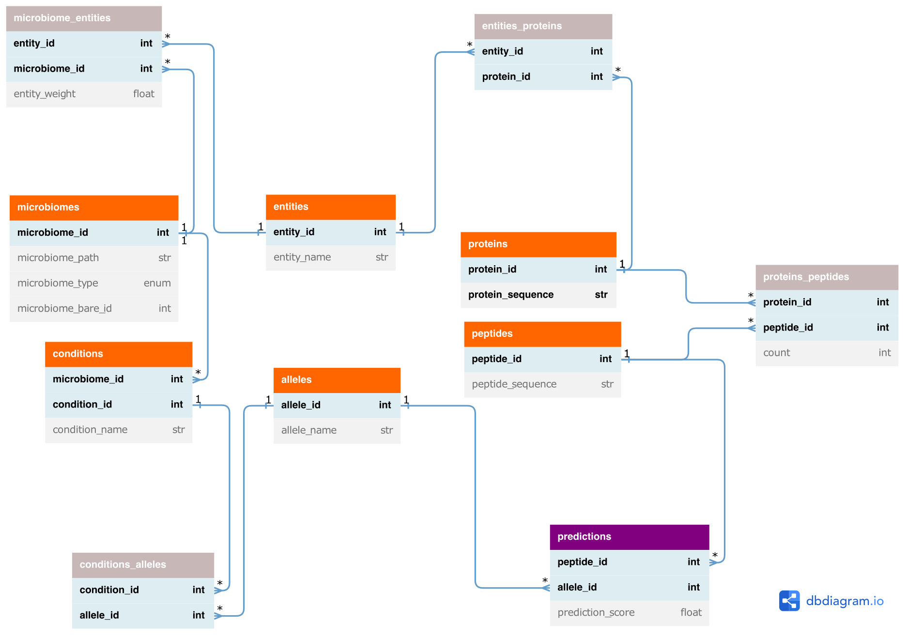

# nf-core/metapep: Output

## Introduction

This document describes the output produced by the pipeline. Most of the plots are taken from the MultiQC report, which summarises results at the end of the pipeline.

The directories listed below will be created in the results directory after the pipeline has finished. All paths are relative to the top-level results directory.

<!-- TODO nf-core: Write this documentation describing your workflow's output -->

## Pipeline overview

The pipeline is built using [Nextflow](https://www.nextflow.io/) and processes data using the following steps:

- [Process input](#metapep-data-model) - Create tables according to the relational data model and checks validity of the samplesheet.
- [Download proteins](#download-proteins) - Download proteins for input type taxa from Entrez.
- [Prodigal](#prodigal) - Predict proteins for input type assembly or bins.
- [Generate peptides](#main-pipeline-output) - Generate peptides from proteins.
- [Report stats](#main-pipeline-output) - Report some statistics on proteins and peptides.
- [Epitope prediction](#main-pipeline-output) - Predict epitopes for given alleles and peptides.
- [Downstream visualizations](#downstream-visualizations) - Produce plots that summarise results.
- [Pipeline information](#pipeline-information) - Report metrics generated during the workflow execution

## Metapep data model

The prediction and downstream analysis of epitopes originating from different microbiomes causes large amounts of data that have to be processed.
Importantly, the redundancy of peptides across different proteins, entities (i.e. taxa, MAGs/bins or contigs), microbiomes and conditions has to be handled to avoid redundant epitope predictions.
Moreover, the relations between those objects, e.g. which peptides occur in which microbiomes, need to be stored.
For this, metapep uses a relational data model that consists of tables that contain the provided or pre-computed data, such as the protein or peptide sequences, as well as of association tables that describe the relations between those objects.
These data tables are used in the downstream visualisation processes, which - as most of the preprocessing processes - make use of [pandas](https://pandas.pydata.org) for data processing.
With this we aim for flexible and easy-to-use pipeline code to facilitate maintenance.
Based on the association tables the relations can be followed from predicted epitopes to microbiomes and conditions and vice versa using the data model.

The output data tables can additionally be used by the user for further custom and more project tailored analysis tasks.

    

- Orange: provided or pre-computed entities
- Gray: associations (n to m relations)
- Purple: Epitope prediction output

Entities correspond to taxa, MAGs/bins, assembly contigs or proteins (if provided as input).

### Supported Allele Models

As not all alleles are supported by all supported tools, the pipeline comes with a functionality to print out txt files containing the corresponding supported alleles for each third party tool before starting the pipeline. This functionality can be reached by using the following call:

`nextflow run nf-core/metapep -profile <YOURPROFILE> --outdir <OUTDIR> --show_supported_models`

Output files

This subbranch of the pipeline will only output the following files:

- `pipeline_info/`
  - Reports generated by Nextflow: `execution_report.html`, `execution_timeline.html`, `execution_trace.txt` and `pipeline_dag.dot`/`pipeline_dag.svg`.
  - `software_versions.yml`: contains information about the tools which are used in this subbranch of the pipeline.
- `model_information/`
  - `tool.vx.x.x.supported_alleles.txt`: contains the names of all supported alleles of the corresponding tool and version.
  - `tool.vx.x.x.supported_lengths.txt`: contains the supported peptide lengths that the corresponding tool can handle.

## Main pipeline output

The main output of the nf-core/metapep pipeline are the data tables as described in the section above.
These contain the generated peptides, the corresponding epitope prediction scores and, among others, all associations to the provided input data, e.g. the alleles, microbiomes and conditions.

Output files

- `db_tables/`
  - `conditions.tsv`: contains condition_id, condition_name and microbiome_id for all unique conditions.
  - `alleles.tsv`: contains allele_id and allele_name for all unique alleles used for epitope prediction.
  - `conditions_alleles.tsv`: matches alleles to conditions. Contains condition_id and allele_id for all unique condition - allele combinations.
  - `microbiomes.tsv`: contains microbiome_id, microbiome_path, microbiome_type, weights_path and microbiome_bare_id for all unique microbiomes (combination of path, type and weights).
  - `entities.tsv`: contains entity_id and entity_name for all unique entities. An entity can be a contig (for input type assembly and bins) or a taxon (for input type taxa).
  - `microbiomes_entities.tsv`: matches entities and their weights to microbiomes. Contains microbiome_id, entity_id and entity_weight for all unique microbiome - entity combinations.
  - `proteins.tsv.gz`: contains protein_id (new unique id), protein_orig_id and protein_sequence for all unique proteins.
  - `entities_proteins.tsv`: matches proteins to entities. Contains entity_id and protein_id for all unique entity - protein combinations.
  - `peptides.tsv.gz`: contains peptide_id and peptide_sequence for all unique peptides. Peptides are generated for downloaded or predicted proteins.
  - `proteins_peptides.tsv`: matches peptides to proteins. Contains protein_id, peptide_id and count (number of occurences of peptide in respective protein) for all unique protein - peptide combinations.
  - `predictions.tsv.gz`: contains peptide_id, prediction_score (epitope prediction score) and allele_id for all unique peptide - allele combinations.

Additionally the pipeline reports some statistics on protein and peptide numbers.

Output files

- `db_tables/`
  - `stats.txt`: contains statistics: unique protein counts, total peptide counts, unique peptide counts, unique peptides across all conditions.

The epitope prediction scoring system and resulting prediction scores depend on the chosen prediction method (`--pred_method`).

- [SYFPEITHI](http://www.syfpeithi.de/index.html): In SYFPEITHI the scoring is based on a position-specific scoring matrix (PSSM), which is built using known MHC binders. For each allele another matrix is used. For comparability the scores are normalized to the highest scoring ligand of each allele, resulting in scores between 0 and 1. Therefore, the final score represents how well a peptide is able to bind in comparison to all annotated binders of a specific allele. For downstream processes such as `prepare_entity_binding_ratios` peptides with a score of ≥0.5 are classified as binders.
- [MHCflurry](https://pubmed.ncbi.nlm.nih.gov/29960884/) and [MCHnuggets](https://pubmed.ncbi.nlm.nih.gov/31871119/): The score is based on a affinity scoring representing an IC50 (the concentration that leads to 50% inhibition of the binding of a standard reference peptide, note that lower IC50 values indicate higher binding affinities). The affinity score is then log-transformed and converted to a scale from 0 to 1 by using the formula: <code>1-log50000(affinity score)</code>. For downstream processes such as `prepare_entity_binding_ratios` a threshold of ≥0.426 is used to classify binders, corresponding to an IC50 of ≤500.

## Intermediate results

The following intermediate results are generated and written to the output directory as well.

Output files

- `db_tables/`
  - `microbiomes_entities.nucl.tsv`: matches entities to microbiomes. Contains entity_name, microbiome_id and entity_weight for all entities of input types assembly and bins.
  - `microbiomes_entities.no_weights.tsv`: matches entities to microbiomes. Contains microbiome_id and entity_id for all unique microbiome - entity combinations.

### Download proteins

Output files

- `entrez_data/`

  - `entities_proteins.entrez.tsv`: matches temporary protein id given by Entrez to entities. Contains protein_tmp_id and entity_name.
  - `microbiomes_entities.entrez.tsv`: matches entities (taxa) and their weights to microbiomes. Contains microbiome_id, entity_id and entity_weight for unique microbiome - entity combinations downloaded from Entrez.
  - `proteins.entrez.tsv.gz`: contains protein_tmp_id (protein id given by Entrez) and protein_sequence for all proteins downloaded from Entrez.
  - `taxa_assemblies.tsv`: matches taxon id to assembly id and can be used as input if only taxon_id was chosen for previously (merge with abundances as required).

- `logs/`
  - `download_proteins.log`: Contains info about the Entrez download of proteins, chosen taxon_ids and specific assembly_ids
  

Proteins are downloaded for input type `taxa` from Entrez.

### Prodigal

Output files

- `prodigal/`
  - `*.gff`: contains proteins predicted by Prodigal in gff format.
  - `proteins.pred_*.tsv.gz`: contains proteins predicted by Prodigal in tsv format. The columns are `protein_tmp_id` (<contig-id_suffix>) and `protein_sequence`.

Proteins are predicted for input type assembly and bins.

### Epitope prediction

Output files

- `logs/`
  - `prediction_warnings.log`: contains warnings that occured during epitope prediction.
  - `unify_peptide_lengths.log`: contains information about available prediction models and for analysis omitted peptide lengths.

## Downstream visualisations

The pipeline generates some basic visualisations comparing the results for the different conditions.

Output files

- `figures/`
  - `entity_binding_ratios.*.pdf`: plots the entity binding ratio per allele. Contains box plots showing the binding ratios per condition and entity. The binding rate is calculated per entity as number of binders divided by total number of peptides. Multiple occurrences of peptides within one protein are not counted.
  - `entity_binding_ratios.with_points.*.pdf`: plots the entity binding ratio per allele. Contains box plots showing the binding ratios per condition and entity. Each point corresponds to one entity (contig, MAG or taxon, depending on input type).
  - `entity_binding_ratios/`
    - `entity_binding_ratios.allele_*.tsv`: data tables for plotting the entity binding ratios per allele. Contain condition_name, binding_rate and entity_weight.
  - `prediction_score_distribution.*.pdf`: plots the score distribution per allele. Contains weighted violin plots showing the distribution of prediction scores per condition.
  - `prediction_scores/`
    - `prediction_scores.allele_*.tsv`: data tables for plotting the prediction scores per allele. Contain prediction_score, condition_name and weight_sum. The weight_sum is calculated as the sum of all weights that belong to the entites the peptide is contained in.

### MultiQC

Output files

- `multiqc/`
  - `multiqc_report.html`: a standalone HTML file that can be viewed in your web browser.
  - `multiqc_data/`: directory containing parsed statistics from the different tools used in the pipeline.
  - `multiqc_plots/`: directory containing static images from the report in various formats.

[MultiQC](http://multiqc.info) is a visualization tool that generates a single HTML report summarising all samples in your project. Most of the pipeline QC results are visualised in the report and further statistics are available in the report data directory.

Results generated by MultiQC collate pipeline QC from supported tools e.g. FastQC. The pipeline has special steps which also allow the software versions to be reported in the MultiQC output for future traceability. For more information about how to use MultiQC reports, see <http://multiqc.info>.

## Pipeline information

Output files

- `pipeline_info/`
  - Reports generated by Nextflow: `execution_report.html`, `execution_timeline.html`, `execution_trace.txt` and `pipeline_dag.dot`/`pipeline_dag.svg`.
  - Reports generated by the pipeline: `pipeline_report.html`, `pipeline_report.txt` and `software_versions.yml`. The `pipeline_report*` files will only be present if the `--email` / `--email_on_fail` parameter's are used when running the pipeline.
  - Reformatted samplesheet files used as input to the pipeline: `samplesheet.valid.csv`.
  - Parameters used by the pipeline run: `params.json`.

[Nextflow](https://www.nextflow.io/docs/latest/tracing.html) provides excellent functionality for generating various reports relevant to the running and execution of the pipeline. This will allow you to troubleshoot errors with the running of the pipeline, and also provide you with other information such as launch commands, run times and resource usage.
